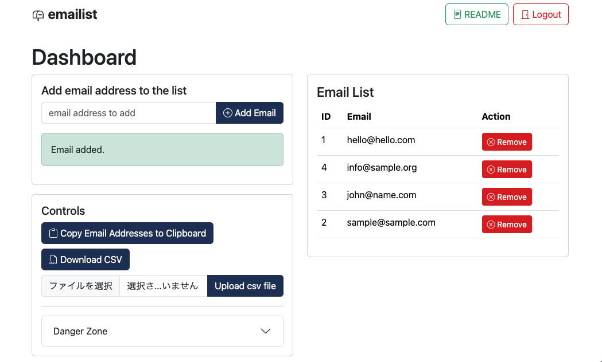
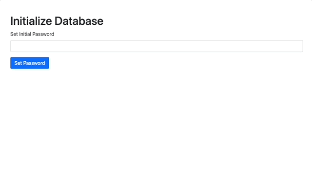

# emailist
A system that makes mailing list management as simple as possible, running on php and sqlite.


## Dependencies
* php
* sqlite

## Getting Started

### 1. Install and initialize database and admin acount on a local server
```
git clone https://github.com/TetsuakiBaba/emailist.git
php -S localhost:8000

// macOS
open http://localhost:8000/init_db.php

// windows OS
start "" "http://localhost:8000/init_db.php"
```
<!-- teaser.gifを挿入 -->


### 2. Customize settings.php according to your environment

### 3. manage email list
Basic operations can be performed from dashboard.php.
* add email
* delete email
* download a csv of the email list
* batch update of email list by csv list
  * This is a csv file with the email address on a new line, in the same format as the downloaded csv file.
* batch deletion of email lists
* delete database

### 4. send email
* send.php (send email to all email addresses)

### 5. Subscribe and Unsubscribe from annoymus users
* subscribe.php (subscribe to email list)
* unsubscribe.php (unsubscribe from email list)

## Deployment
* You can deploy this system on a web server that supports php and sqlite. In that case, please place emailist.db in a location that is not accessible to general users. emaillist.db is a somewhat complicated procedure if you place it outside of the service root, as you will need to change all the paths in the php code to load emailist.db. We recommend using .htaccess to restrict access at this time.