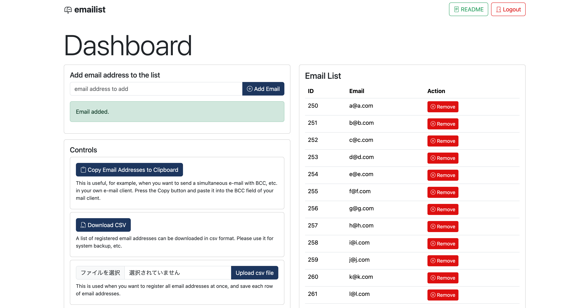
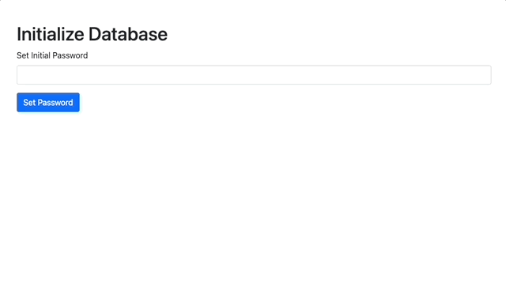

# emailist
A system that makes mailing list management as simple as possible, running on php and sqlite.


## Dependencies
* php
* sqlite

## Getting Started

1. clone this repository
```bash
git clone https://github.com/TetsuakiBaba/emailist.git
cd emailist
```

2. Create config.php
```bash
touch config.php
```

3. Save config.php

Modify the following settings according to your environment.
```php
<?php
// config.php
$service_name = "Your Service Name";
$footer_text = "Your Service Name &copy; 2024";

$readme_title = "emailist";
$readme_text = <<<HTML
<p>
emailist is a system that makes mailing list management as simple as possible, running on php and sqlite.
</p>
<p>
Administrators can add, delete, etc. email lists through dashboard.php. The administrator can also send emails simultaneously from the send.php page. General users can freely register their own email addresses via subscribe.php. They can also unsubscribe at any time from unsubscribe.php.
</p>
<p>
Please refer to the <a href="https://github.com/TetsuakiBaba/emailist" target="_blank">README on the github</a> page for details on how to deploy this system.
</p>
HTML;


$db_path = "./emailist.db";

// email address to receive password reset link
$admin_email = "admin@example.com";

// email address to be used as send.php
$emailSender = "no-reply@example.com";

// email subject and message for confirmation and unsubscription
$confirmationSubject = "Subscription Confirmation";
$confirmationMessage = "You have successfully subscribed to our mailing list.";

// email subject and message for unsubscription confirmation
$unsubscribeConfirmationSubject = "Unsubscription Confirmation";
$unsubscribeConfirmationMessage = "You have successfully unsubscribed from our mailing list.";

?>
```

4. Run the following command
```bash
php -S localhost:8000
```

5. open init_db.php in your browser
```bash
open http://localhost:8000/init_db.php
```


<!-- teaser.gifを挿入 -->


### 2. manage email list
Basic operations can be performed from dashboard.php.
* add email
  * This operation can also be performed by other users using subscribe.php.
* remove email
  * This operation can also be performed by other users using unsubscribe.php.
* download a csv of the email list
  * Download all email lists in the database table as csv files.
* batch update of email list by csv list
  * This is a csv file with the email address on a new line, in the same format as the downloaded csv file.
* batch deletion of email lists
  * Delete all email lists in the database table. Since the database is not deleted, IDs are not initialized.
* delete database
  * This will delete the database and create a new one. This is useful when you want to delete all email addresses and start over.If you delete the database, be sure to run it again from init_db.php.

### 3. send email
* emailist uses SMTPMailer to send mails. Please follow the instructions in the following link to set up SMTPMailer.

  * SMTPMailer github repository: https://github.com/TetsuakiBaba/SMTPMailer

#### Directory structure
<pre>
emailist/
└─ SMTPMailer/
   └─ PHPMailer/
</pre>

### 4. Subscribe and Unsubscribe from annoymus users
* subscribe.php (subscribe to email list)
* unsubscribe.php (unsubscribe from email list)

## Deployment
* You can deploy this system on a web server that supports php and sqlite. In that case, please place emailist.db in a location that is not accessible to general users. The location of emailist.db can be specified at once from settings.php.